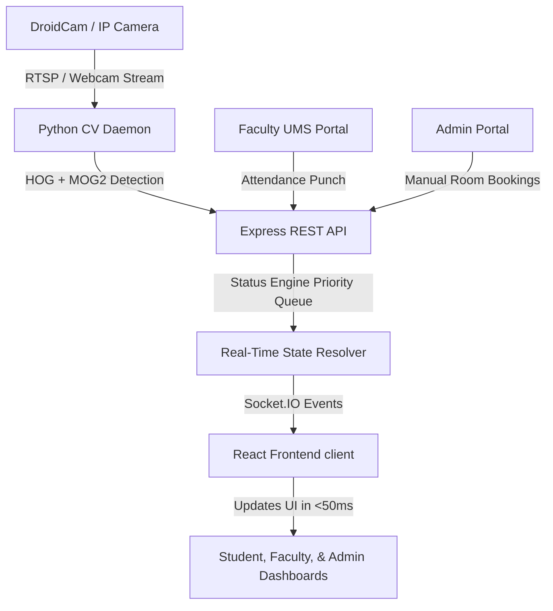

# CLASS-PASS: Smart Classroom Availability & Emergency Reallocation System

> **A Smart Campus Solution for Lovely Professional University (LPU)**
> Developed as a Capstone Project by the Department of Computer Science and Engineering.

---

## 📖 Overview

**CLASS-PASS** is a real-time, IoT- and Computer Vision-powered spatial management and emergency reallocation system. In large academic ecosystems like LPU, traditional room allocations rely on static timetables that fail to reflect the dynamic reality of day-to-day operations (canceled lectures, early releases, or emergency academic seminars).

CLASS-PASS bridges the physical-digital divide by integrating:
1. **Authoritative baseline schedules** (university timetable).
2. **Software inputs** (faculty attendance punching via UMS).
3. **Physical environmental sensors** (Python/OpenCV-based edge-computing cameras).

It computes real-time room occupancy and broadcasts it instantaneously to students, faculty, and administrators.

---

## 🏗️ System Architecture



### 🧠 The Status Engine Algorithm

To resolve conflicts (e.g., a room is scheduled but empty, or a room is booked but the faculty has not arrived), the system employs a priority-based queue to calculate the final state of any classroom:

1. **Active Faculty Attendance (Highest Priority)**: If a teacher punches in/out, this override determines room occupancy.
2. **Admin Bookings**: Confirmed manual bookings for exams, workshops, or seminars.
3. **IoT Camera Detection**: OpenCV detecting human presence in the room.
4. **Timetable Schedule**: Default scheduled timetable slots.
5. **Free / Available (Lowest Priority)**: Default room state.

---

## 🛠️ Technology Stack

* **Frontend**: React.js (Vite, Single Page Application), Vanilla CSS, Socket.IO-Client
* **Backend**: Node.js, Express.js, Socket.IO (WebSockets)
* **Edge Sensory Pipeline**: Python 3, OpenCV (HOG + SVM & MOG2 Background Subtraction)
* **Integration**: REST APIs & Full-Duplex WebSockets for sub-100ms real-time UI updates.

---

## 🚀 Getting Started

### 📋 Prerequisites
* **Node.js**: v18.0.0 or higher
* **Python**: v3.8 or higher (for the camera sensor)

---

### 💻 Web App & Backend Setup

1. **Install Dependencies**:
   Navigate to the project root directory and run:
   ```bash
   npm install
   ```

2. **Running the Application**:
   You can run both the Express backend and Vite frontend concurrently:
   * **Standard Run Command**:
     ```bash
     npm run dev:all
     ```
   * **Direct Node Bypass Run Command** *(Useful if your local environment has npm script spawning issues)*:
     * Run the Express server (starts on `http://localhost:5000`):
       ```bash
       node server/server.js
       ```
     * Run the Vite dev server (starts on `http://localhost:3000`):
       ```bash
       node node_modules/vite/bin/vite.js
       ```

---

### 📷 Camera Detector Setup (Python Edge Daemon)

The Python daemon captures camera feeds, runs body detection, and reports occupancy back to the server.

1. **Install Python dependencies**:
   ```bash
   pip install -r camera/requirements.txt
   ```

2. **Find Your Camera Index**:
   Connect your camera (e.g., DroidCam client or system webcam) and run:
   ```bash
   python camera/find_camera.py
   ```

3. **Start the Detector**:
   * **Using CLI**:
     ```bash
     # With live preview window
     python camera/detector.py --room 34-401 --camera 1 --preview

     # Headless mode (production)
     python camera/detector.py --room 34-401 --camera 1
     ```
   * **Using Windows Batch Script**:
     Simply double-click or run:
     ```bash
     start-detector.bat
     ```

---

## 📊 Performance & Findings

* **UI Latency**: WebSocket events propagate updates across clients in `~45ms` on local networks.
* **Camera Detection FPS**: Python detector runs at `12-15 FPS` on standard consumer-grade CPUs using lightweight HOG + SVM classifications.
* **Debouncing Logic**: A 2-cycle validation delay prevents "flicker" state transitions due to visual noise or temporary camera obstruction.

---

## 👥 Authors & Project Details

* **Project Title**: CLASS-PASS: Smart IoT and Computer Vision Powered Classroom Availability and Emergency Reallocation System
* **Department**: Department of Computer Science and Engineering
* **Institution**: Lovely Professional University (LPU), Phagwara, Punjab, India
* **Authors/Students**:
  * **Suryansh Vashisht**
  * **Adarsh Jha**
  * **Manya Singh**
  * **Jasmeen Kaur**
